# Secure Application Design (AWS + Apache + Spring Boot)

This project was built for the Enterprise Architecture Workshop: Secure Application Design. The solution uses a two-server architecture: Server 1 runs Apache to serve an asynchronous HTML/JS frontend, and Server 2 runs Spring Boot to expose REST endpoints for authentication and protected resources using Spring Security, BCrypt password hashing, and TLS support for deployment.

## Getting Started

These instructions will get you a copy of the project up and running on your local machine for development and testing purposes. See deployment for notes on how to deploy the project on a live system.

### Prerequisites

What things you need to install the software and how to install them

```
Java 21
Maven 3.9+
Git
```

### Installing

A step by step series of examples that tell you how to get a development env running

Say what the step will be

```bash
git clone https://github.com/Rogerrdz/Secure_Application_Design.git
cd "Secure Application Desing/springserver"
```

And repeat

```bash
mvn clean package -DskipTests
mvn spring-boot:run
```

until finished

```bash
curl -X POST "http://localhost:8443/api/auth/login" \
  -H "Content-Type: application/json" \
  -d '{"username":"admin","password":"123456"}'
```

End with an example of getting some data out of the system or using it for a little demo

```bash
curl -X GET "http://localhost:8443/api/secure/hello" \
  -H "Authorization: Basic YWRtaW46MTIzNDU2"
```

## Running the tests

Explain how to run the automated tests for this system

```bash
cd springserver
mvn test
```

### Break down into end to end tests

Explain what these tests test and why

These tests validate the full authentication flow and access control for protected resources.

```http
POST /api/auth/register
POST /api/auth/login
GET /api/secure/hello
GET /api/secure/profile
GET /api/secure/users
GET /api/secure/users/{id}
GET /api/secure/status
```

Endpoint evidence (screenshots in resources):

POST /api/auth/register  
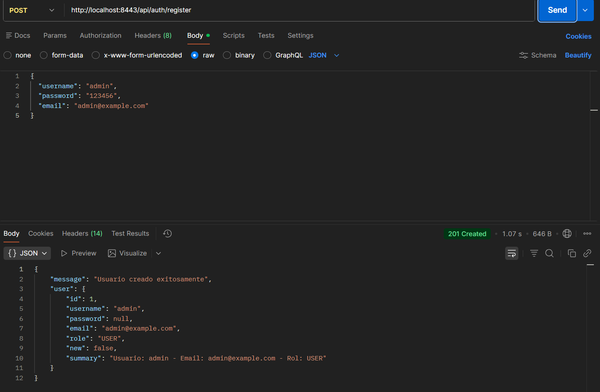

POST /api/auth/login  
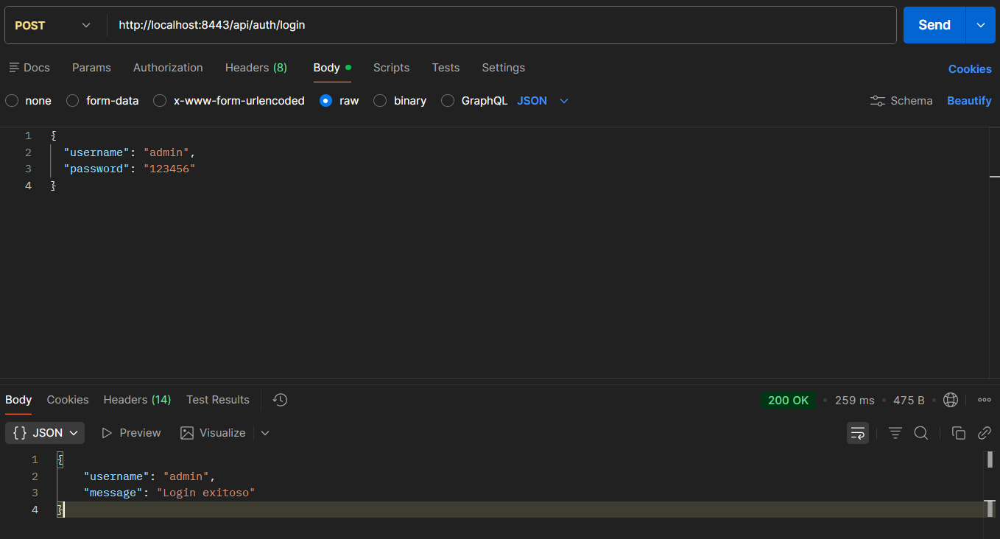

GET /api/secure/hello (authenticated)  
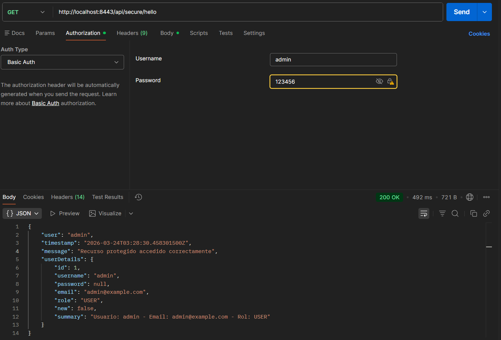

GET /api/secure/profile (authenticated)  
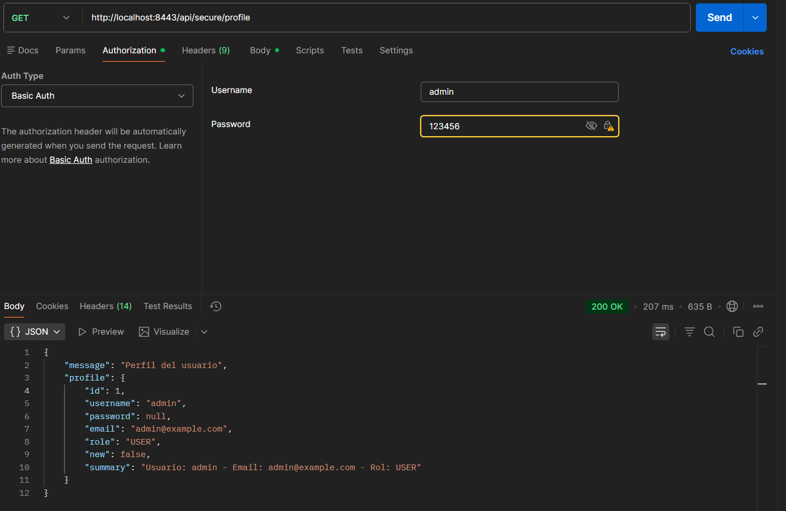

GET /api/secure/users (authenticated)  


GET /api/secure/users/{id} (authenticated)  
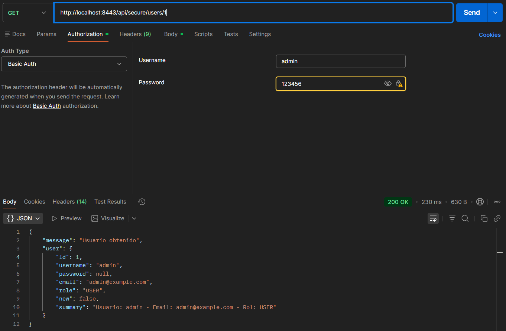

GET /api/secure/status (authenticated)  
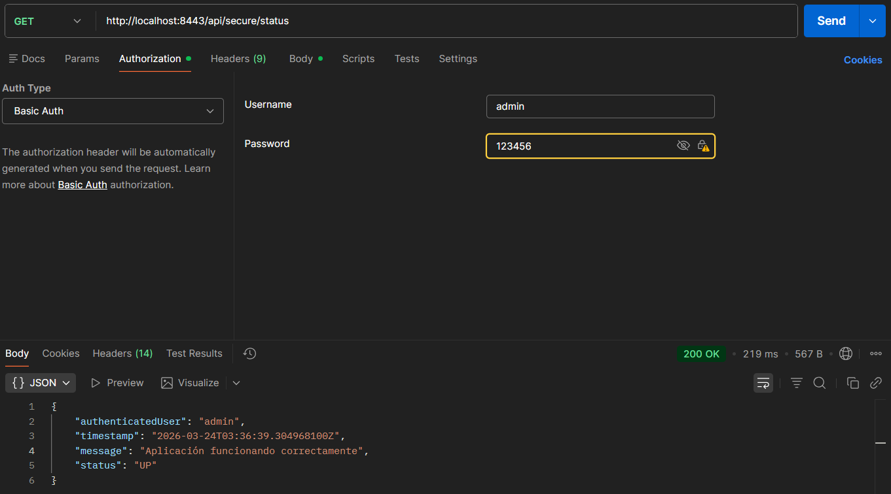

Request without credentials or with invalid credentials  
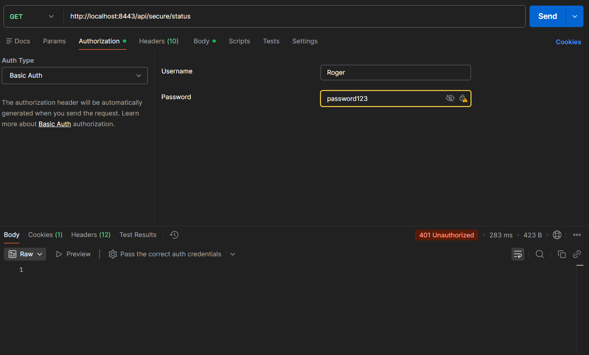

### Apache Frontend Evidence

POST /api/auth/register from Apache frontend  
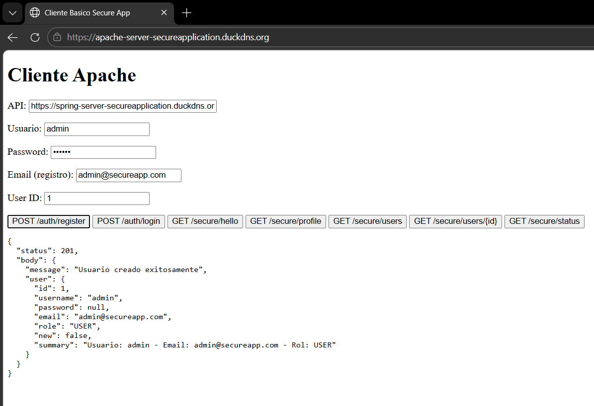

POST /api/auth/login from Apache frontend  
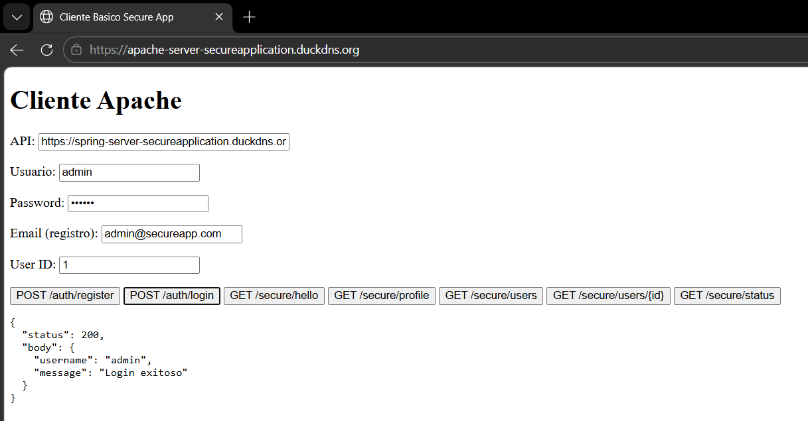

GET /api/secure/hello from Apache frontend  
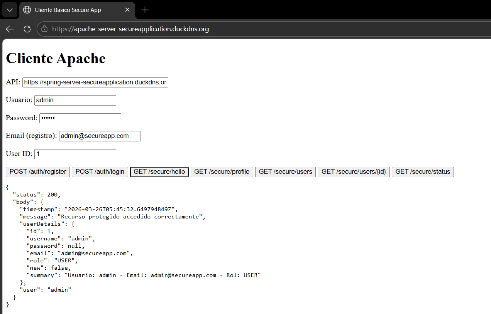

GET /api/secure/profile from Apache frontend  
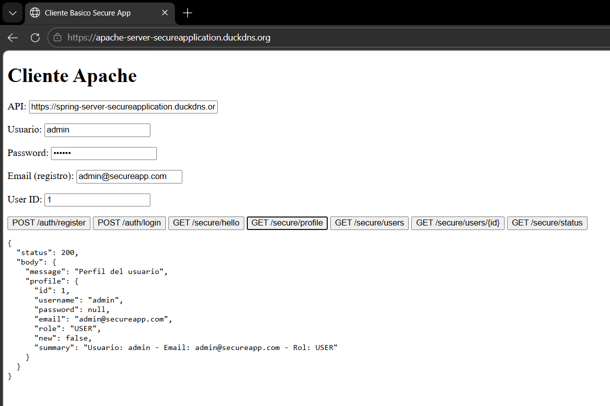

GET /api/secure/users from Apache frontend  
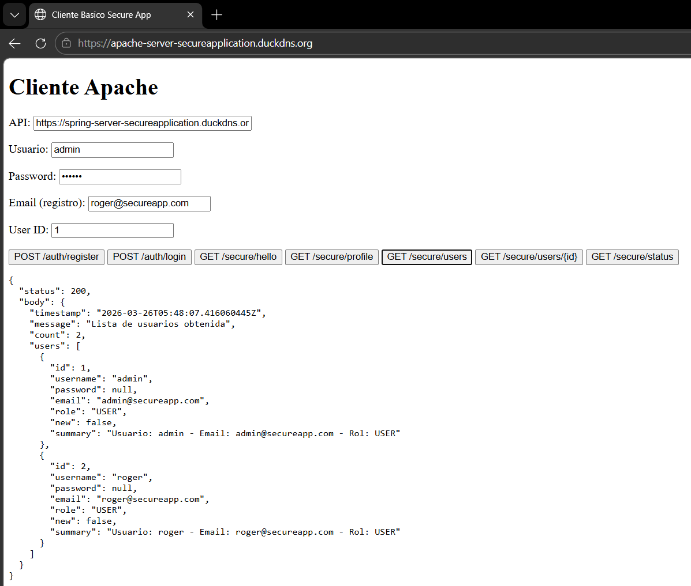

GET /api/secure/users/{id} from Apache frontend  
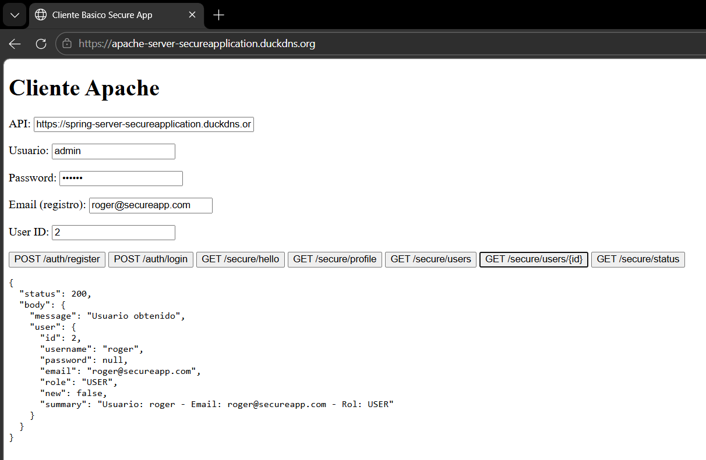

GET /api/secure/status from Apache frontend  
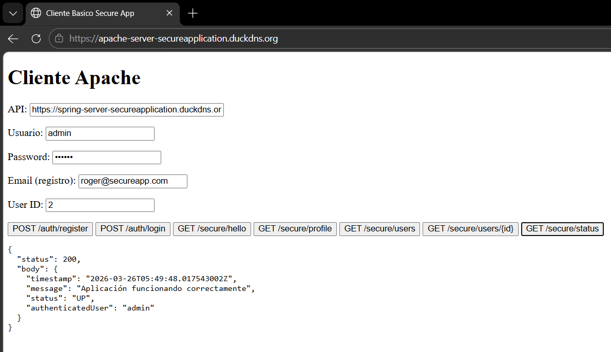

## Video of the functionality

Video demo: [Watch functionality video](resources/video_funcionamiento.mp4)

### And coding style tests

Explain what these tests test and why

These checks validate code formatting, clean compilation, and baseline conventions to keep the codebase consistent and readable.

```bash
cd springserver
mvn -q -DskipTests package
```

## Deployment

Add additional notes about how to deploy this on a live system

Recommended deployment uses two EC2 instances:

1. Server 1 (Apache)
- Install Apache and serve the frontend (index.html).
- Open ports 80/443.
- Configure TLS with Let's Encrypt.

2. Server 2 (Spring Boot)
- Install Java 21 and Maven.
- Open ports 22/8443.
- Run the Spring app (`java -jar target/springserver-1.0.0.jar`).
- For Spring TLS, configure `SSL_ENABLED`, `SSL_KEY_STORE`, and `SSL_KEY_STORE_PASSWORD`.

## Built With

* [Spring Boot](https://spring.io/projects/spring-boot) - Backend framework
* [Maven](https://maven.apache.org/) - Dependency Management
* [Apache HTTP Server](https://httpd.apache.org/) - Frontend static hosting

## Contributing

Please read [CONTRIBUTING.md](https://gist.github.com/PurpleBooth/b24679402957c63ec426) for details on our code of conduct, and the process for submitting pull requests to us.

## Versioning

We use [SemVer](http://semver.org/) for versioning. For the versions available, see the [tags on this repository](https://github.com/Rogerrdz/Secure_Application_Design/tags).

## Authors

* **Rogerrdz** - *Initial work*

See also the list of [contributors](https://github.com/Rogerrdz/Secure_Application_Design/contributors) who participated in this project.

## License

This project is licensed under the MIT License - see the [LICENSE.md](LICENSE.md) file for details

## Acknowledgments

* Lab_Reference project for architectural guidance
* Enterprise Architecture Workshop context
* Spring and Apache documentation

